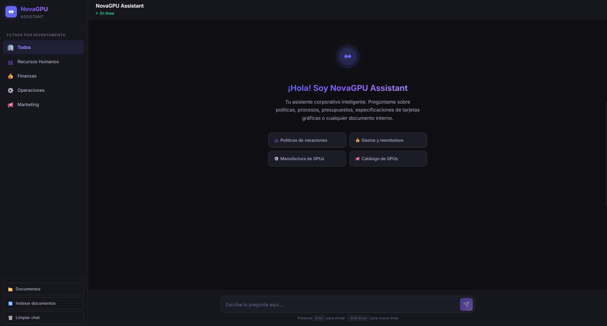
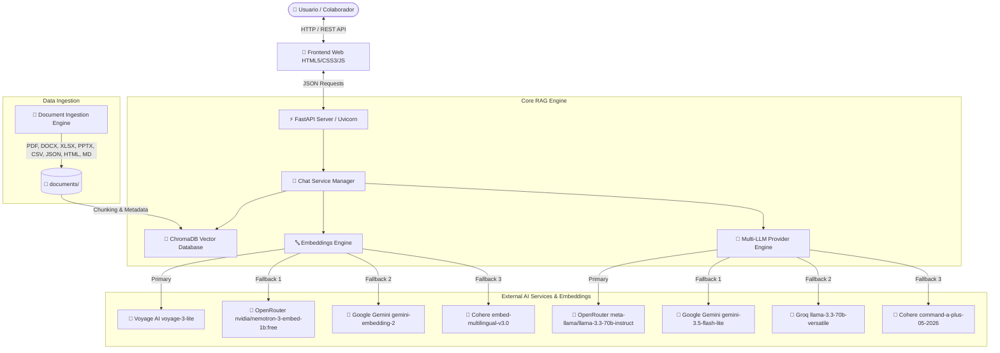
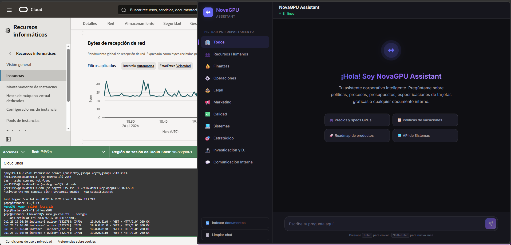
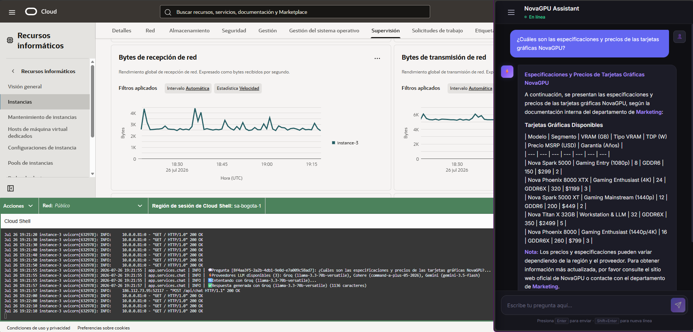

# 🚀 NovaGPU Assistant - Agente Corporativo de IA Multi-Proveedor (FastAPI + RAG)

**Asistente Virtual Corporativo Inteligente para NovaGPU Technologies**  
*Desarrollado para el Challenge de Inteligencia Artificial de Alura Latam.*

🌐 **App en vivo (24/7)**: [http://149.130.172.8:8000/](http://149.130.172.8:8000/) | 📑 **Swagger API**: [http://149.130.172.8:8000/docs](http://149.130.172.8:8000/docs)

---

## 📌 Tabla de Contenidos

1. [📋 Descripción General](#-descripción-general)
2. [📸 Demostración e Interfaz](#-demostración-e-interfaz)
3. [✨ Características Principales](#-características-principales)
4. [🏗️ Arquitectura del Sistema](#️-arquitectura-del-sistema)
5. [🔄 Flujo de Funcionamiento (RAG Engine)](#-flujo-de-funcionamiento-rag-engine)
6. [⚡ Tecnologías Principales](#-tecnologías-principales)
7. [📁 Estructura del Proyecto](#-estructura-del-proyecto)
8. [📄 Cobertura de Formatos y Categorías de Documentos](#-cobertura-de-formatos-y-categorías-de-documentos)
9. [🛠️ Instalación y Ejecución Local](#️-instalación-y-ejecución-local)
10. [🤖 Modelos de LLM y Embeddings Soportados](#-modelos-de-llm-y-embeddings-soportados)
11. [☁️ Despliegue en Oracle Cloud Infrastructure (OCI)](#️-despliegue-en-oracle-cloud-infrastructure-oci)
12. [🚀 Roadmap y Mejoras Futuras](#-roadmap-y-mejoras-futuras)
13. [📝 Licencia](#-licencia)

---

## 📋 Descripción General

**NovaGPU Assistant** es un agente de Inteligencia Artificial abierto a todos los colaboradores de **NovaGPU Technologies**, una empresa ficticia dedicada al diseño y fabricación de tarjetas gráficas (GPUs) de alto rendimiento para gaming, estaciones de trabajo y supercómputo de Inteligencia Artificial.

El asistente funciona como una **base de conocimiento conversacional centralizada**, respondiendo preguntas en tiempo real mediante técnicas de **RAG (Retrieval-Augmented Generation)** procesando la documentación oficial de la organización.

> [!NOTE]
> 🚧 **Estado del Proyecto: En Desarrollo Activo (WIP)**  
> **NovaGPU Assistant** se encuentra en constante evolución y mejora continua. Si bien el motor de RAG, el sistema de fallback multi-proveedor por límites de cuota y la interfaz conversacional están 100% funcionales y operativos 24/7, el sistema se encuentra en fase de incorporación de nuevos módulos clave de administración y seguridad.

---

## 📸 Demostración e Interfaz

### 🖼️ Captura de la Interfaz Web


### 🎥 Demostración de Funcionamiento

https://github.com/user-attachments/assets/9ce6e3f7-66f8-41b8-8deb-c2733f19c6c7

---

## ✨ Características Principales

- 🧠 **Arquitectura RAG Multiformato de Alto Rendimiento**: Procesa e indexa automáticamente 8+ formatos de documentos corporativos (PDF, Word, Excel, PowerPoint, Markdown, CSV, JSON, HTML).
- 🛡️ **Sistema de Fallback Ininterrumpido (Resiliencia 24/7)**: Conmutación automática en milisegundos entre 4 proveedores de LLM principales (**OpenRouter**, **Google Gemini**, **Groq** y **Cohere**) para garantizar disponibilidad continua ante límites de cuota (HTTP 429 Rate Limits).
- 🔒 **Guardrails de Ámbito Corporativo (Out-of-Domain Protection)**: Restricción estricta mediante *System Prompt* para rechazar amablemente preguntas de conocimiento general, matemáticas o trivia ajenas a la empresa, garantizando que el asistente responda **únicamente sobre la documentación interna de NovaGPU Technologies**.
- 🏢 **Filtrado Semántico por Departamentos**: Permite acotar las respuestas a 10 dominios organizacionales específicos (RRHH, Finanzas, Operaciones, Legal, Marketing, Calidad, Sistemas, Estrategia, R&D y Comunicación).
- 📊 **Trazabilidad y Citas Transparentes**: Cada respuesta generada incluye las fuentes de información exactas (nombre de archivo, departamento y tipo de documento) utilizadas como contexto.
- 🔄 **Reindexación Dinámica en Tiempo Real**: Endpoint de API `/api/reindex` e interfaz gráfica con botón para reconstruir la base vectorial sin reiniciar el servicio cuando se agregan o actualizan documentos.
- 🎨 **Interfaz de Usuario Moderna y Responsiva**: Diseñada en Dark Theme corporativo con tipografía Inter, tarjetas con sugerencias de preguntas rápidas, estados de carga animados e indicador de servidor en vivo.
- ⚡ **Base de Datos Vectorial Persistente Autoreiterable**: ChromaDB con manejo transparente de colecciones y recreación dinámica ante cambios en las dimensiones de embeddings.

---

## 🏗️ Arquitectura del Sistema

El sistema sigue una arquitectura por capas basada en microservicios ligeros con FastAPI y LangChain:



---

## 🔄 Flujo de Funcionamiento (RAG Engine)

El ciclo de vida de una consulta dentro de **NovaGPU Assistant** consta de 6 etapas bien definidas:

1. **Ingesta y Fragmentación (Chunking)**:  
   `app/rag/loader.py` recorre la carpeta `documents/`, identifica el formato del archivo y utiliza cargadores especializados de LangChain (`PyPDFLoader`, `UnstructuredWordDocumentLoader`, `UnstructuredExcelLoader`, `UnstructuredPowerPointLoader`, `CSVLoader`, `JSONLoader`, `BSHTMLLoader`, `UnstructuredMarkdownLoader`). Los textos se dividen en fragmentos manejables con superposición (overlap) para preservar el contexto.

2. **Generación de Vector Embeddings**:  
   Cada fragmento de texto se convierte en un vector denso de alta dimensión usando el motor de embeddings configurado (`Voyage AI voyage-3-lite` por defecto, con fallback automático a `OpenRouter (NVIDIA Nemotron 3 Embed 1B)`, `Google Gemini` o `Cohere`).

3. **Almacenamiento e Indexación Vectorial**:  
   Los vectores generados se persisten en **ChromaDB** (`chroma_db/`), etiquetados con metadatos clave como departamento, nombre de archivo y extensión.

4. **Búsqueda Semántica de Similitud (Retrieval)**:  
   Cuando el usuario realiza una pregunta (ej. *"¿Cuáles son los precios de las GPUs NovaGPU?"*), la consulta se vectoriza y ChromaDB realiza una búsqueda por similitud de coseno para recuperar los fragmentos más relevantes. Si el usuario seleccionó un filtro de departamento (ej. `marketing`), la búsqueda se restringe exclusivamente a ese metadato.

5. **Aumento del Contexto y Prompting (Augmentation)**:  
   `app/rag/prompts.py` ensambla las instrucciones del sistema, la verificación de ámbito corporativo (*out-of-domain guardrails*) y las restricciones de veracidad, concatenando los fragmentos recuperados junto con la pregunta original.

6. **Inferencia y Respuesta con Fallback Ininterrumpido (Generation)**:  
   `app/services/chat.py` envía la solicitud al proveedor principal de LLM (OpenRouter con `meta-llama/llama-3.3-70b-instruct`). Si el servidor recibe una respuesta de límite de tasa (`HTTP 429`), el motor conmuta instantáneamente al segundo proveedor (Google Gemini con `gemini-3.5-flash-lite`), luego a Groq (`llama-3.3-70b-versatile`) y finalmente a Cohere (`command-a-plus-05-2026`), garantizando la entrega de la respuesta al usuario sin errores.

---

## ⚡ Tecnologías Principales

- **Backend Web**: FastAPI (Python 3.10+) & Uvicorn Server
- **Inferencia LLM (Multi-proveedor con Fallback automático por Rate Limit)**:
  - 🥇 **OpenRouter**: `meta-llama/llama-3.3-70b-instruct` (o cualquier modelo OpenRouter)
  - 🥈 **Google Gemini**: `gemini-3.5-flash-lite`
  - 🥉 **Groq**: `llama-3.3-70b-versatile`
  - 🏅 **Cohere**: `command-a-plus-05-2026`
- **Embeddings Vectoriales (Multi-proveedor con Fallback)**:
  - 🧠 **Voyage AI**: `voyage-3-lite`
  - 🧠 **OpenRouter**: `nvidia/nemotron-3-embed-1b:free`
  - 🧠 **Google Gemini**: `gemini-embedding-2`
  - 🧠 **Cohere**: `embed-multilingual-v3.0`
- **Vector Database**: ChromaDB (Base de datos vectorial persistente con autorecreación ante cambios de dimensión)
- **Orquestación RAG**: LangChain 0.3 (`langchain-openai`, `langchain-google-genai`, `langchain-groq`, `langchain-cohere`, `langchain-voyageai`)
- **Frontend**: HTML5, Vanilla CSS3 (Dark Theme corporativo) & JavaScript ES6+

---

## 📁 Estructura del Proyecto

```text
NovaGPU-Assistant/
├── app/                        # Backend principal en FastAPI y RAG Engine
│   ├── core/                   # Configuración del sistema y Pydantic Settings
│   │   ├── __init__.py
│   │   └── config.py           # Gestión de variables de entorno y proveedores
│   ├── models/                 # Modelos y esquemas de datos HTTP
│   │   ├── __init__.py
│   │   └── schemas.py          # Schemas Pydantic (ChatRequest, ChatResponse)
│   ├── rag/                    # Módulo central de RAG (Retrieval-Augmented Generation)
│   │   ├── __init__.py
│   │   ├── embeddings.py       # Gestor multi-proveedor de Embeddings con fallback
│   │   ├── loader.py           # Cargador multiformato (PDF, DOCX, XLSX, PPTX, CSV, JSON, HTML, MD)
│   │   ├── prompts.py          # Plantillas de Prompts de sistema estructurados
│   │   └── vectorstore.py      # Integración y persistencia con ChromaDB
│   ├── routes/                 # Enrutadores API de FastAPI
│   │   ├── __init__.py
│   │   └── chat_routes.py      # Endpoints REST (/api/chat, /api/reindex, /health)
│   ├── services/               # Lógica de negocio y orquestación LLM
│   │   ├── __init__.py
│   │   └── chat.py             # Motor conversacional con conmutación automática por Rate Limit
│   ├── utils/                  # Funciones auxiliares del sistema
│   │   └── __init__.py
│   └── main.py                 # Instancia principal de FastAPI, CORS y rutas estáticas
├── assets/                     # Recursos multimedia de la documentación (imágenes, gifs, mp4)
│   ├── .gitkeep
│   ├── frontend-preview.png    # Captura principal del Frontend
│   ├── demo.mp4                # Video de demostración de la aplicación
│   ├── oci-dashboard.png       # Evidencia de instancia y Cloud Shell en OCI
│   ├── oci-demo.mp4            # Video de demostración en Oracle Cloud
│   └── oci-query-logs.png      # Evidencia de logs RAG en tiempo real en OCI
├── chroma_db/                  # Base de datos vectorial persistente (ChromaDB / SQLite)
├── documents/                  # Base de conocimientos corporativa organizada por departamentos
│   ├── calidad/                # Normas ISO 9001:2015, planes CAPA
│   ├── comunicacion/           # Newsletters HTML y comunicados corporativos
│   ├── estrategia/             # Plan estratégico 2026-2028 y roadmap de productos
│   ├── finanzas/               # Estados de resultados Q2 (CSV/XLSX) y presupuesto
│   ├── investigacion/          # Estudios de mercado y R&D Nova Quantum V2
│   ├── legal/                  # Políticas GDPR/LFPDPPP, código de ética y garantías
│   ├── marketing/              # Catálogo MSRP de GPUs (CSV), precios y pitch deck
│   ├── operaciones/            # Procesos de manufactura, logística y control de calidad
│   ├── rrhh/                   # Beneficios HTML, organigrama CSV y política de vacaciones PDF
│   └── sistemas/               # Especificación API JSON, ciberseguridad y manual OCI
├── static/                     # Archivos estáticos del cliente web
│   ├── script.js               # Cliente JS ES6+, llamadas API, renderizado Markdown y citas
│   └── style.css               # Estilos CSS Vanilla (Dark Theme corporativo responsivo)
├── templates/                  # Plantillas HTML
│   └── index.html              # Interfaz de usuario SPA (Single Page Application)
├── tests/                      # Suite de pruebas automatizadas
│   ├── test_cohere.py          # Pruebas de integración con Cohere API
│   └── test_vectorstore.py     # Pruebas de almacenamiento e indexación en ChromaDB
├── .env.example                # Plantilla de variables de entorno del proyecto
├── .gitignore                  # Reglas de exclusión de Git
├── README.md                   # Documentación oficial del proyecto
├── pyrightconfig.json          # Configuración del analizador estático Pyright / Pylance
├── requirements.txt            # Dependencias del proyecto Python
└── run.py                      # Script ejecutable de inicio rápido con Uvicorn
```

---

## 📄 Cobertura de Formatos y Categorías de Documentos

El agente comprende y procesa automáticamente 8+ formatos de archivo en 10 áreas clave de la organización:

### 📁 Formatos de Archivo Soportados
- **PDF** (`.pdf`) — Manuales de calidad y políticas
- **Word** (`.docx`) — Procedimientos y contratos
- **Excel** (`.xlsx`) — Estados financieros y presupuestos
- **PowerPoint** (`.pptx`) — Presentaciones de roadmap
- **Markdown** (`.md`) — Documentación técnica, políticas y minutas
- **CSV** (`.csv`) — Organigramas, estados de resultados y catálogo de precios
- **JSON** (`.json`) — Especificación de APIs internas y telemetría
- **HTML** (`.html`) — Newsletters internas y planes de beneficios

### 🏢 Dominios Organizacionales (10 Categorías)
1. **Recursos Humanos (`rrhh`)**: Políticas de vacaciones, onboarding, beneficios (HTML) y estructura organizacional (CSV).
2. **Financiero y Contable (`finanzas`)**: Estados de resultados Q2 (CSV), presupuesto anual y política de reembolsos.
3. **Operacional (`operaciones`)**: Procesos de manufactura de GPUs, control de calidad en línea y logística.
4. **Legal y Compliance (`legal`)**: Términos de garantía, políticas GDPR/LFPDPPP y código de ética.
5. **Marketing y Comercial (`marketing`)**: Catálogo de GPUs (CSV), precios MSRP, manual de marca y pitch deck.
6. **Calidad (`calidad`)**: Plan de auditorías ISO 9001:2015, plan CAPA y estándares de producto.
7. **Datos y Sistemas (`sistemas`)**: API interna (JSON), ciberseguridad y manual de nube OCI.
8. **Estratégico (`estrategia`)**: Plan estratégico 2026-2028 y roadmap tecnológico de GPUs.
9. **Investigación y Desarrollo (`investigacion`)**: Estudio de mercado de GPUs y business case Nova Quantum V2.
10. **Comunicación Interna (`comunicacion`)**: Comunicados ejecutivos, boletín mensual (HTML) y minutas de dirección.

---

## 🛠️ Instalación y Ejecución Local

### 1. Clonar el repositorio
```bash
git clone git@github.com:ECjhonny/NovaGPU.git
cd NovaGPU-Assistant
```

### 2. Crear y activar el entorno virtual
```bash
python -m venv venv
# Windows (PowerShell)
.\venv\Scripts\activate
# Linux / Mac
source venv/bin/activate
```

### 3. Instalar dependencias
```bash
pip install -r requirements.txt
```

### 4. Configurar variables de entorno (`.env`)
Copia el archivo `.env.example` a `.env`:
```bash
cp .env.example .env
```

Edita `.env` e ingresa tus claves de API y preferencia de proveedores:

> ⚠️ **Importante:** No uses comentarios en la misma línea que un valor (e.g. `LLM_PROVIDER=groq # comentario`). Esto causa errores cuando se ejecuta con `systemd` en servidores Linux.

```env
# --- Selección de Proveedores ---
# Opciones LLM: openrouter (por defecto), gemini, groq, cohere
# Opciones Embeddings: voyage (por defecto), openrouter, gemini, cohere
LLM_PROVIDER=openrouter
EMBEDDINGS_PROVIDER=voyage

# --- OpenRouter (LLM & Embeddings) ---
OPENROUTER_API_KEY=tu_clave_openrouter_aqui
OPENROUTER_MODEL=meta-llama/llama-3.3-70b-instruct
OPENROUTER_EMBEDDING_MODEL=nvidia/nemotron-3-embed-1b:free

# --- Gemini (LLM & Embeddings - Fallback) ---
GEMINI_API_KEY=tu_clave_gemini_aqui
GEMINI_MODEL=gemini-3.5-flash-lite
GEMINI_EMBEDDING_MODEL=gemini-embedding-2

# --- Groq (LLM) ---
GROQ_API_KEY=gsk_tu_clave_groq_aqui
GROQ_MODEL=llama-3.3-70b-versatile

# --- Cohere (LLM & Embeddings) ---
COHERE_API_KEY=tu_clave_cohere_aqui
COHERE_MODEL=command-a-plus-05-2026
COHERE_EMBEDDING_MODEL=embed-multilingual-v3.0

# --- Voyage AI (Embeddings) ---
VOYAGE_API_KEY=pa-tu_clave_voyage_aqui
VOYAGE_EMBEDDING_MODEL=voyage-3-lite
```

### 5. Ejecutar la aplicación FastAPI con Uvicorn
```bash
# Opción 1: Mediante el ejecutable
python run.py

# Opción 2: Usando Uvicorn directamente
uvicorn app.main:app --reload --port 8000
```

Accede desde tu navegador:
- **Interfaz del Chat**: [http://localhost:8000](http://localhost:8000)
- **Documentación Interactiva Swagger**: [http://localhost:8000/docs](http://localhost:8000/docs)

---

## 🤖 Modelos de LLM y Embeddings Soportados

| Proveedor | Tipo | Modelo por Defecto | Variable `.env` |
| :--- | :--- | :--- | :--- |
| **OpenRouter** | LLM | `meta-llama/llama-3.3-70b-instruct` | `OPENROUTER_API_KEY` |
| **Groq** | LLM | `llama-3.3-70b-versatile` | `GROQ_API_KEY` |
| **Google Gemini** | LLM | `gemini-3.5-flash-lite` | `GEMINI_API_KEY` |
| **Google Gemini** | Embeddings | `gemini-embedding-2` | `GEMINI_API_KEY` |
| **Cohere** | LLM | `command-a-plus-05-2026` | `COHERE_API_KEY` |
| **Cohere** | Embeddings | `embed-multilingual-v3.0` | `COHERE_API_KEY` |
| **Voyage AI** | Embeddings | `voyage-3-lite` | `VOYAGE_API_KEY` |

> 🛡️ **Sistema de Fallback Automático con Detección de Rate Limit**: Si un proveedor LLM alcanza su límite de consultas (HTTP 429 / Rate Limit), el sistema conmuta **automáticamente** entre **OpenRouter**, **Gemini**, **Groq** y **Cohere** sin interrumpir el servicio. Para embeddings, se implementan reintentos automáticos con backoff exponencial.

---

## ☁️ Despliegue en Oracle Cloud Infrastructure (OCI)

El proyecto está desplegado y probado en la nube de **Oracle Cloud Infrastructure (OCI)** con Oracle Linux.

### 1. Crear Compute Instance
Crear una máquina virtual en OCI con **Oracle Linux 8/9** o **Ubuntu 22.04 LTS**.

### 2. Configurar Security List (Red)
En la consola de OCI → **Networking** → **VCN** → **Security List**, agregar regla de ingreso:
- **Source CIDR**: `0.0.0.0/0` | **Protocol**: TCP | **Port**: `80, 8000`

### 3. Abrir puertos en el firewall del OS y deshabilitar Apache
```bash
# Oracle Linux: Abrir puertos en firewalld
sudo firewall-cmd --permanent --add-service=http
sudo firewall-cmd --permanent --add-service=https
sudo firewall-cmd --permanent --add-port=8000/tcp
sudo firewall-cmd --reload

# Detener y deshabilitar Apache (viene activo por defecto en Oracle Linux y ocupa el puerto 80)
sudo systemctl stop httpd
sudo systemctl disable httpd
```

### 4. Instalar dependencias y clonar
```bash
sudo dnf install -y python3 python3-pip git nginx
git clone https://github.com/ECjhonny/NovaGPU.git NovaGPU
cd NovaGPU
python3 -m venv venv && source venv/bin/activate
pip install --upgrade pip && pip install -r requirements.txt
cp .env.example .env && nano .env   # Configurar API Keys
```

### 5. Configurar servicio systemd (ejecución 24/7)

> ⚠️ **Importante:** ChromaDB usa SQLite internamente, que no soporta accesos concurrentes. Se debe usar `--workers 1` para evitar errores de colección no encontrada.

```bash
sudo nano /etc/systemd/system/novagpu.service
```
```ini
[Unit]
Description=Servicio NovaGPU Assistant (FastAPI)
After=network.target

[Service]
User=opc
WorkingDirectory=/home/opc/NovaGPU
ExecStart=/home/opc/NovaGPU/venv/bin/uvicorn app.main:app --host 0.0.0.0 --port 8000 --workers 1
Restart=always
RestartSec=5
EnvironmentFile=/etc/novagpu.env

[Install]
WantedBy=multi-user.target
```
```bash
sudo cp /home/opc/NovaGPU/.env /etc/novagpu.env
sudo systemctl daemon-reload
sudo systemctl enable novagpu
sudo systemctl start novagpu
```

### 6. Configurar Nginx como Reverse Proxy

En Oracle Linux, la configuración de Nginx se gestiona desde `/etc/nginx/conf.d/`.

```bash
# Habilitar SELinux para permitir que Nginx haga proxy a FastAPI
sudo setsebool -P httpd_can_network_connect 1

# Crear archivo de configuración
sudo nano /etc/nginx/conf.d/novagpu.conf
```
```nginx
server {
    listen 80;
    server_name _;
    location / {
        proxy_pass http://127.0.0.1:8000;
        proxy_set_header Host $host;
        proxy_set_header X-Real-IP $remote_addr;
        proxy_set_header X-Forwarded-For $proxy_add_x_forwarded_for;
        proxy_set_header X-Forwarded-Proto $scheme;
    }
}
```
```bash
# Comentar el bloque server por defecto en nginx.conf para evitar conflictos (si existe)
# sudo nano /etc/nginx/nginx.conf → comentar el bloque "server { listen 80; ... }"

sudo nginx -t && sudo systemctl enable nginx && sudo systemctl restart nginx
```

### 7. Verificar
- **Chat en vivo (24/7)**: [http://149.130.172.8:8000/](http://149.130.172.8:8000/)
- **Documentación Swagger**: [http://149.130.172.8:8000/docs](http://149.130.172.8:8000/docs)
- **Logs en tiempo real**: `sudo journalctl -u novagpu -f`

### 📸 Evidencia de Despliegue y Telemetría en OCI

https://github.com/user-attachments/assets/606782f4-ea97-4d43-9683-2d1d7ee9cb0e

#### 🖥️ Instancia OCI y Consola de Cloud Shell


#### ⚡ Consulta RAG y Logs de Inferencia en Tiempo Real


---

## 🚀 Roadmap y Mejoras Futuras

El proyecto se encuentra en desarrollo activo y evolución constante. Las siguientes características principales están planificadas para las próximas versiones:

- [ ] 🔑 **Sistema de Autenticación y Login de Usuarios (AuthN / AuthZ)**:
  - Módulo de inicio de sesión y registro seguro mediante **JWT** (JSON Web Tokens) u **OAuth2**.
  - Control de acceso basado en roles (**RBAC**) para restringir la visibilidad de documentos confidenciales según el departamento o nivel del colaborador autenticado.
- [ ] 📤 **Gestión y Carga de Documentación desde la Interfaz Web**:
  - Módulo interactivo de carga de archivos (Drag & Drop) en el frontend sin necesidad de acceso SSH al servidor.
  - Procesamiento, fragmentación e indexación automática en tiempo real en la base de datos vectorial ChromaDB inmediatamente tras subir un nuevo documento.
- [ ] 💬 **Persistencia de Historial Conversacional por Usuario**:
  - Almacenamiento y recuperación de sesiones de chat previas asociadas al perfil del usuario.
- [ ] 📊 **Panel de Analítica y Métricas de Rendimiento**:
  - Dashboard interactivo para administradores con estadísticas de uso, preguntas frecuentes y distribución de tráfico entre proveedores LLM (Groq, Cohere, Gemini).
- [ ] 📱 **Optimización Avanzada de Interfaz Móvil**:
  - Adaptación dinámica de viewport (`dvh`), ajuste del teclado táctil en smartphones y mejoras en la visibilidad del panel de conversación en dispositivos móviles.

---

## 📝 Licencia

Proyecto desarrollado para el Challenge de Inteligencia Artificial de **Alura Latam**.  
© 2026 NovaGPU Technologies. Todos los derechos reservados.
